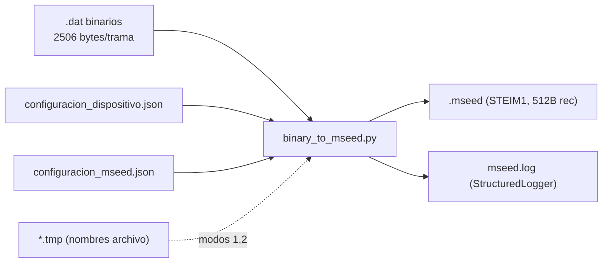
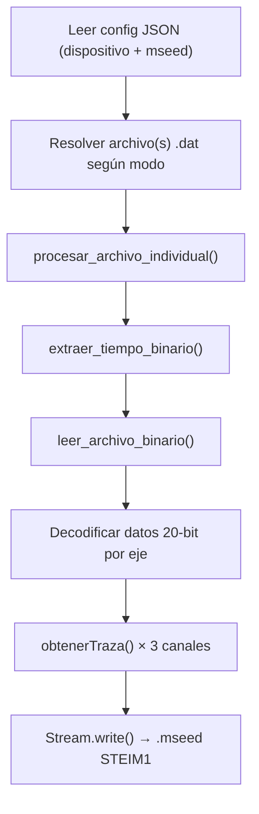

# binary_to_mseed.py — Contexto para Agentes IA

> Script Python que convierte archivos binarios `.dat` (tramas de 2506 bytes del acelerógrafo) a formato miniSEED usando ObsPy. Soporta 4 modos de operación y utiliza logging estructurado.

**Ruta**: `scripts/operation/mseed/binary_to_mseed.py`
**Versión**: 886 LOC | **Lenguaje**: Python 3 | **Dependencias**: ObsPy, NumPy

---

## Arquitectura



---

## Modos de Operación

| Modo | CLI | Fuente del nombre de archivo | Dir entrada | Dir salida |
|------|-----|------------------------------|-------------|------------|
| 1 | `--continuous` o `1` | `NombreArchivoRegistroContinuo.tmp` (línea 2) | `directorios.registro_continuo` | `directorios.archivos_mseed` |
| 2 | `--event` o `2` | `NombreArchivoEventoExtraido.tmp` (línea 1) | `directorios.eventos_extraidos` | `directorios.eventos_extraidos` |
| 3 | `--file <archivo>` o `3 <archivo>` | Argumento CLI (nombre o ruta absoluta) | `directorios.registro_continuo` (si relativo) | `directorios.archivos_mseed` |
| 4 | `--dir <directorio>` | Todos los `*.dat` del directorio | Ruta CLI | `directorios.archivos_mseed` |

> **Nota**: Modo 1 lee la **segunda línea** del `.tmp` (archivo anterior ya cerrado). Modo 2 lee la **primera línea**.

---

## Pipeline de Conversión



---

## Estructura de Trama Binaria (2506 bytes)

```
Byte 0:          Fuente de reloj (no usado en conversión)
Bytes 1-2500:    250 muestras × 10 bytes
                 [ID(1B)] [X3,X2,X1, Y3,Y2,Y1, Z3,Z2,Z1 (9B)]
Bytes 2500-2505: Timestamp [año, mes, día, hora, minuto, segundo]
```

### Decodificación de ejes (20 bits, complemento a 2)

```python
# Para cada eje j (0=X, 1=Y, 2=Z), bytes en posiciones j*3+1, j*3+2, j*3+3
xValue = ((dato_1 << 12) & 0xFF000) + ((dato_2 << 4) & 0xFF0) + ((dato_3 >> 4) & 0xF)
# Signo: si xValue >= 0x80000 → negativo
xValue[mask] = -1 * ((~xValue[mask] + 1) & 0x7FFFF)
```

---

## Extracción de Fecha — Dos Métodos

Configurado por `USAR_FECHA_FILENAME` en `configuracion_mseed.json`:

| Método | `USAR_FECHA_FILENAME` | Fuente de fecha | Fuente de hora |
|--------|----------------------|-----------------|----------------|
| Tradicional | `false` | Bytes 2500-2502 de la trama (año+2000, mes, día) | Bytes 2503-2505 de la trama |
| Filename | `true` | Regex del nombre: `CODIGO_AAMMDD-HHMMSS.dat` | Bytes 2503-2505 de la trama |

> **Nota**: El método filename fue añadido porque el timestamp de la trama puede tener errores de fecha (ej. cruce de medianoche). La hora siempre se extrae de la trama binaria.

---

## Funciones — Resumen

### Lectura y Parsing

| Función | Descripción |
|---------|-------------|
| `read_fileJSON(nameFile)` | Lee JSON genérico, retorna `dict` o `None` |
| `leer_archivo_binario(archivo, logger, usar_fecha_filename)` | Lee `.dat` en chunks de 60 tramas, valida tiempos, detecta gaps, retorna `(datos[3][N], segundos_faltantes, tiempo_lectura, ts_inicio, ts_final)` |
| `extraer_tiempo_binario(archivo, usar_fecha_filename)` | Extrae timestamp de la primera trama → `dict` con campos numéricos y strings |
| `extraer_fecha_desde_nombre_archivo(archivo_path)` | Regex `^[A-Z0-9]+_(\d{2})(\d{2})(\d{2})-\d{6}\.dat$` → `{anio, mes, dia}` |
| `extraer_timestamp_completo_binario(archivo, usar_fecha_filename)` | Lee primera y última trama → `(datetime_inicio, datetime_final)` |
| `extraer_timestamps_mseed(archivo_mseed)` | Lee `.mseed` con ObsPy → `(datetime_inicio, datetime_final)` |

### Conversión

| Función | Descripción |
|---------|-------------|
| `nombrar_archivo_mseed(codigo_estacion, tiempo_binario)` | Genera nombre: `{CODIGO}_{YYYYMMDD}_{HHMMSS}.mseed` |
| `conversion_mseed_digital(fileName, path, tiempo, datos, faltantes, params, logger)` | Crea 3 trazas (X,Y,Z) → `Stream` → escribe `.mseed` |
| `obtenerTraza(nombre, num_canal, data, tiempo, faltantes, params)` | Construye `obspy.Trace` con headers SEED; inserta ceros en gaps |
| `procesar_archivo_individual(binary_file, path_salida, codigo, config, logger, usar_fecha)` | Orquesta lectura + conversión de un archivo; retorna `(bool, mensaje, info_dict)` |

---

## Naming de Canales miniSEED

Determinado dinámicamente en `obtenerTraza()`:

```
Prefijo:  E (>80Hz)  o  S (≤80Hz)
Tipo:     L (SISMICO) o  N (otro, ej. ACELEROGRAFICO)
Eje:      Tomado de CANAL(18): "XYZ" → X, Y, Z
```

**Ejemplo** a 250Hz sensor acelerográfico: `ENX`, `ENY`, `ENZ`

---

## Manejo de Gaps (Segundos Faltantes)

1. `leer_archivo_binario()` detecta saltos `> 1` en la secuencia de segundos
2. Reporta gaps vía `logger.data_warning()` con conteo y top-5 saltos
3. `obtenerTraza()` inserta bloques de ceros (`np.zeros(fsample)`) en cada segundo faltante
4. Ajusta `npts` del header para reflejar longitud total con gaps rellenos

---

## Validación de Tramas

- **Filtro de tiempo**: Descarta tramas donde `hora>23`, `minuto>59`, o `segundo>59`
- **Tramas inválidas**: Logueadas individualmente con `data_warning("trama_invalida")`
- **Archivo vacío/corrupto**: Si no hay tramas válidas → `convert_fail("sin_tramas_validas")` y retorna

---

## Configuración

### `configuracion_dispositivo.json`

```json
{
  "dispositivo": { "id": "DEV00", "fuente_reloj": "1" },
  "directorios": {
    "registro_continuo": "/home/rsa/projects/acelerografo/datos/RC/",
    "eventos_extraidos": "/home/rsa/projects/acelerografo/datos/ED/",
    "archivos_mseed": "/home/rsa/projects/acelerografo/datos/MSEED/"
  }
}
```

### `configuracion_mseed.json`

| Campo | Uso en el script |
|-------|-----------------|
| `CODIGO(1)` | Código estación para nombre archivo y header SEED |
| `SENSOR(2)` | `"SISMICO"` → canal `*L*`, otro → `*N*` |
| `MUESTREO(20)` | Frecuencia de muestreo (250 Hz default) |
| `RED(19)` | Network code en header SEED |
| `UBICACION(17)` | Location code en header SEED |
| `CANAL(18)` | `"XYZ"` — sufijos de eje para canales |
| `CALIDAD(16)` | Data quality flag (`"D"`) |
| `USAR_FECHA_FILENAME` | `true`/`false` — método de extracción de fecha |

---

## Logging

**Archivo**: `$PROJECT_LOCAL_ROOT/log-files/mseed.log`
**Motor**: `StructuredLogger` con `RotatingFileHandler` (5 MB × 3 backups)
**Verbosidad**: Configurable (`DEBUG`, `INFO`, `SUMMARY`)

| Tag | Nivel | Cuándo |
|-----|-------|--------|
| `INIT` | SUMMARY | Inicio del script |
| `CONVERT_START` | INFO | Inicio de conversión |
| `READ_OK` | DEBUG | Archivo binario leído |
| `DATA_WARNING` | INFO | Tramas inválidas, gaps detectados |
| `CONVERT_OK` | SUMMARY | Conversión exitosa |
| `CONVERT_FAIL` | SUMMARY | Conversión fallida |
| `CONFIG_ERROR` | SUMMARY | Error de configuración |
| `SUMMARY` | SUMMARY | Resumen final |

---

## Dependencias

| Librería | Uso |
|----------|-----|
| `obspy` | `UTCDateTime`, `Trace`, `Stream`, `read` — core miniSEED |
| `numpy` | Lectura binaria, decodificación 20-bit, manipulación arrays |
| `argparse` | 4 modos CLI |
| `structured_logger` | Local (`scripts/operation/structured_logger.py`) |
| `json` | Lectura de configuración |
| `glob`, `re` | Modo directorio y regex de filename |

**Ejecución**:
```bash
# Requiere $PROJECT_LOCAL_ROOT definida
python3 binary_to_mseed.py --continuous          # Modo 1
python3 binary_to_mseed.py --dir /ruta/datos     # Modo 4 (batch)
```

---

## Rendimiento Estimado

| Métrica | Valor |
|---------|-------|
| Chunk de lectura | 60 tramas (150 KB) por iteración |
| Archivo 1 hora (3600 tramas) | ~9 MB `.dat` → ~3.6 MB `.mseed` |
| Tiempo conversión (RPi 3B+) | ~2-5 seg por archivo de 1 hora |

---

## Limitaciones Conocidas

- Inserción de ceros en gaps distorsiona la señal en fronteras de gaps
- No valida integridad de datos (sin CRC/checksum)
- Modo filename asume que el archivo no cruza medianoche para fecha final
- `extraer_tiempo_binario()` solo lee la primera trama (puede tener timestamp corrupto)
- Sin compresión adicional post-STEIM1
- Reutiliza parsing JSON solo al inicio (no recarga en batch del modo 4)
