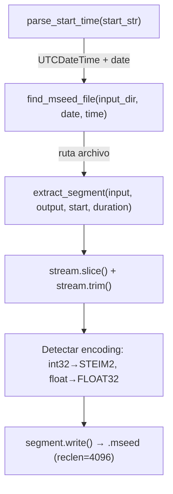

# extract_segment.py — Contexto para Agentes IA

> Script Python que extrae segmentos temporales de archivos miniSEED horarios. Dado un timestamp UTC y una duración en segundos, localiza automáticamente el archivo `.mseed` correcto y genera un nuevo archivo con el segmento recortado.

**Ruta**: `scripts/operation/mseed/extract_segment.py`
**LOC**: 335 | **Lenguaje**: Python 3 | **Dependencias**: ObsPy

---

## Uso

```bash
# Requiere $PROJECT_LOCAL_ROOT definida

# Básico: extraer 60 segundos a partir de un timestamp UTC
python3 extract_segment.py --start "2024-01-15Z19:30:45.250" --duration 60

# Con directorios personalizados
python3 extract_segment.py -i /datos/mseed -o /datos/output \
    -s "2024-01-15Z19:30:45.250" -d 60

# Archivo de salida específico
python3 extract_segment.py -s "2024-01-15Z19:30:45.250" -d 60 \
    -o /datos/output/evento_001.mseed
```

| Argumento | Requerido | Default | Descripción |
|-----------|-----------|---------|-------------|
| `--start`, `-s` | Sí | — | Timestamp UTC, formato `YYYY-MM-DDZHH:MM:SS[.fff]` |
| `--duration`, `-d` | Sí | — | Duración en segundos (acepta decimales) |
| `--input`, `-i` | No | `$PROJECT_LOCAL_ROOT/resultados/mseed` | Directorio de entrada con `.mseed` |
| `--output`, `-o` | No | `$PROJECT_LOCAL_ROOT/resultados/eventos-extraidos/{auto}.mseed` | Archivo o directorio de salida |

---

## Pipeline



---

## Funciones

| Función | Descripción |
|---------|-------------|
| `parse_start_time(start_str)` | Parsea `"YYYY-MM-DDZHH:MM:SS.fff"` → `(UTCDateTime, datetime)`. Requiere `Z` como separador |
| `find_mseed_file(input_dir, target_date, target_time_utc)` | Busca archivos con patrón `^[A-Z0-9]+_{YYYYMMDD}_\d{6}\.mseed$`, luego verifica metadata ObsPy para encontrar el que contiene el timestamp |
| `generate_output_filename(input_filename, start_time_utc)` | Genera nombre: `{STATION}_{YYYYMMDD}_{HHMMSS}.mseed` basado en el nuevo timestamp |
| `extract_segment(input_file, output_file, start_time_utc, duration)` | Lee `.mseed`, `slice()+trim()`, detecta encoding, escribe segmento |

---

## Búsqueda de Archivo

`find_mseed_file()` opera en dos pasos:

1. **Filtro por nombre**: Regex `^[A-Z0-9]+_{YYYYMMDD}_\d{6}\.mseed$` sobre archivos del directorio
2. **Verificación por metadata**: Lee headers con `obspy.read(headonly=True)` y compara `starttime ≤ target ≤ endtime`

Si no hay coincidencia exacta, lista los archivos disponibles en stderr con sus rangos temporales.

---

## Encoding de Salida

Detección automática basada en el tipo de datos:

| Tipo datos | Encoding | Código |
|-----------|----------|--------|
| `np.floating` | FLOAT32 | 4 |
| `np.int32` (default) | STEIM2 | 11 |

**Record length de salida**: 4096 bytes (vs 512 en `binary_to_mseed.py`)

---

## Naming del Archivo de Salida

- **Si el nombre de entrada tiene formato** `STATION_YYYYMMDD_HHMMSS.mseed`:
  - Genera `STATION_{nueva_fecha}_{nueva_hora}.mseed`
- **Si no coincide el formato**: `{nombre_original}_extracted_{timestamp}.mseed`
- **Si `--output` es directorio**: usa nombre auto-generado dentro del directorio
- **Si `--output` es archivo**: usa exactamente esa ruta

---

## Diferencias con binary_to_mseed.py

| Aspecto | `binary_to_mseed.py` | `extract_segment.py` |
|---------|----------------------|----------------------|
| Entrada | `.dat` binarios | `.mseed` existentes |
| Operación | Conversión completa | Recorte temporal |
| Record length | 512 bytes | 4096 bytes |
| Encoding | STEIM1 | STEIM2 o FLOAT32 (auto) |
| Logging | `StructuredLogger` | Solo `print()` + stderr |
| Configuración | 2 archivos JSON | Solo `$PROJECT_LOCAL_ROOT` |

---

## Limitaciones Conocidas

- No soporta ventanas que crucen entre dos archivos horarios consecutivos
- Solo busca archivos con patrón `[A-Z0-9]+_YYYYMMDD_HHMMSS.mseed` (no soporta otros formatos de nombre)
- Sin logging estructurado (usa `print()` directo)
- Lee el archivo completo en memoria antes de recortar (`obspy.read()` sin `starttime`/`endtime`)
- No valida que la duración no exceda el contenido del archivo
