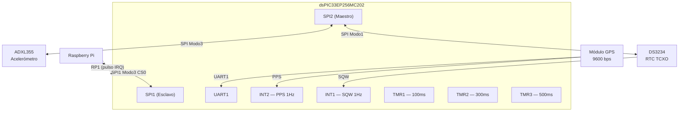
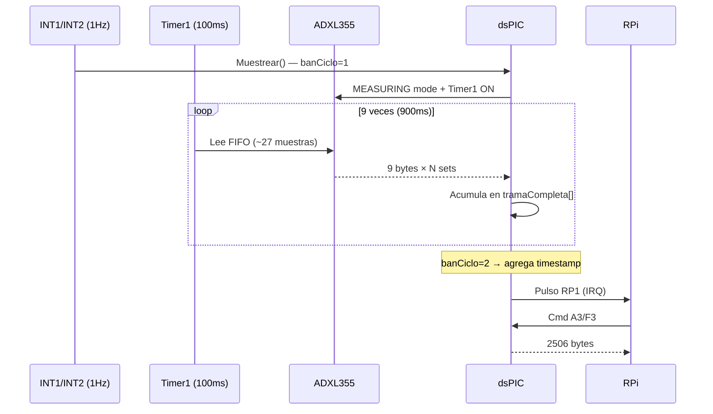
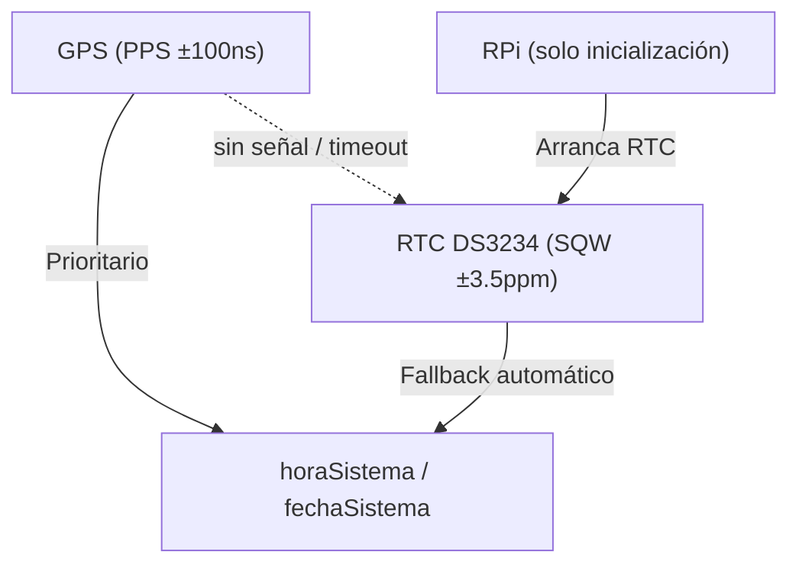

# Firmware dsPIC33EP — Contexto para Agentes IA

> Firmware embebido en dsPIC33EP256MC202 a 80 MHz. Adquiere datos del acelerómetro ADXL355, sincroniza tiempo con GPS/RTC/RPi, y transmite tramas de 2506 bytes a la Raspberry Pi vía SPI.

**Ruta**: `scripts/firmware/`
**MCU**: dsPIC33EP256MC202 (80 MHz, 256KB Flash, 32KB RAM)
**Autor**: Milton Munoz

---

## Arquitectura de Hardware



### Pines de Control

| Pin | Función | Descripción |
|-----|---------|-------------|
| RA4 (RP1) | Salida | Interrupción a RPi (datos listos / tiempo disponible) |
| RB4 (RP2) | Salida | Reservado |
| RB12 | Salida | LED de estado (conmuta 1Hz) |
| RB15 (INT1) | Entrada | SQW del RTC (1Hz) |
| RB14 (INT2) | Entrada | PPS del GPS (1Hz) |

---

## Estructura de Trama (2506 bytes)

```
Byte 0:         Fuente de reloj
Bytes 1-2500:   250 muestras × 10 bytes
                 [ID(1B)] [X3,X2,X1, Y3,Y2,Y1, Z3,Z2,Z1 (9B)]
                 Ejes: 20 bits complemento a 2 por eje
Bytes 2501-2506: Timestamp [año, mes, día, hora, minuto, segundo]
```

**Fuentes de reloj**: `0`:RPi | `1`:GPS | `2`:RTC | `3`:GPS sin señal | `4`:Error cabecera GPS | `5`:Timeout GPS

---

## Módulos de Firmware

### firmware_dspic.c (~792 LOC) — Principal

Contiene `main()`, interrupciones, muestreo continuo y protocolo SPI con RPi.

**Variables globales clave**:

| Variable | Tipo | Descripción |
|----------|------|-------------|
| `tramaCompleta[2506]` | `unsigned char[]` | Buffer de trama para envío a RPi |
| `datosFIFO[243]` | `unsigned char[]` | 27 muestras × 9 bytes del FIFO |
| `tiempo[6]` | `unsigned char[]` | Timestamp actual |
| `horaSistema` | `unsigned long` | Segundos desde 00:00:00 (0–86399) |
| `fechaSistema` | `unsigned long` | Formato YYMMDD |
| `fuenteReloj` | `unsigned char` | 0–5 según tabla de fuentes |
| `tasaMuestreo` | `unsigned char` | 1=250Hz, 2=125Hz, 4=62.5Hz, 8=31.25Hz |

---

### ADXL355_SPI.c (~89 LOC) — Driver Acelerómetro

| Función | Descripción |
|---------|-------------|
| `ADXL355_init(tMuestreo)` | Reset, rango ±2G, configura ODR según tasa |
| `ADXL355_write_byte(addr, val)` | Escritura SPI (dirección << 1, bit0=0) |
| `ADXL355_read_byte(addr)` | Lectura SPI (dirección << 1, bit0=1) |
| `ADXL355_read_FIFO(*vectorFIFO)` | Lee 1 set (9 bytes: X3,X2,X1,Y3,Y2,Y1,Z3,Z2,Z1) |

**Registros relevantes**: `FIFO_DATA`=0x11, `FIFO_ENTRIES`=0x05, `POWER_CTL`=0x2D, `Range`=0x2C, `Filter`=0x28

**Tasas soportadas**:

| `tasaMuestreo` | ODR | Filtro | Interrupciones TMR1 |
|----------------|-----|--------|----------------------|
| 1 | 250 Hz | 62.5 Hz | 9 (cada 100ms) |
| 2 | 125 Hz | 31.25 Hz | 19 |
| 4 | 62.5 Hz | 15.625 Hz | 39 |
| 8 | 31.25 Hz | 7.813 Hz | 79 |

---

### TIEMPO_GPS.c (~82 LOC) — Parser GPS NMEA

| Función | Descripción |
|---------|-------------|
| `GPS_init()` | Configura GPS con comandos PMTK (1Hz, solo GPRMC, SBAS) |
| `RecuperarHoraGPS(*trama)` | Extrae hhmmss → hora×3600 + min×60 + seg |
| `RecuperarFechaGPS(*trama)` | Extrae DDMMYY → YY×10000 + MM×100 + DD |

**Flujo de recepción** (interrupción UART1 byte a byte):
1. Busca cabecera `$GPRMC`
2. Captura payload hasta `*`
3. Extrae hora (pos 1–6), fecha (pos 44+), valida flag `A` (pos 12)
4. Si válido: `fuenteReloj=1`, activa PPS
5. Si inválido: `fuenteReloj=3`, fallback RTC

---

### TIEMPO_RPI.c (~27 LOC) — Tiempo desde RPi

| Función | Descripción |
|---------|-------------|
| `RecuperarHoraRPI(*trama)` | trama[3–5] → hora×3600 + min×60 + seg |
| `RecuperarFechaRPI(*trama)` | trama[0–2] → año×10000 + mes×100 + día |

---

### TIEMPO_RTC.c (~260 LOC) — Driver RTC DS3234

| Función | Descripción |
|---------|-------------|
| `DS3234_init()` | Control=0x20 (SQW 1Hz), ControlStatus=0x08 (oscilador ON) |
| `DS3234_setDate(hora, fecha)` | Programa RTC (convierte a BCD) |
| `RecuperarHoraRTC()` | Lee hora → segundos desde medianoche |
| `RecuperarFechaRTC()` | Lee fecha → formato YYMMDD |
| `IncrementarFecha(fecha)` | +1 día con manejo de meses/bisiestos |
| `AjustarTiempoSistema(hora, fecha, *trama)` | Convierte a formato de 6 bytes para trama |

**Registros**: Lectura 0x00–0x06 (seg–año BCD), Escritura 0x80–0x86, Control 0x8E, Status 0x8F

---

## Sistema de Interrupciones

| ISR | Prioridad | Trigger | Función |
|-----|-----------|---------|---------|
| `spi_1()` | 3 | SPI1 byte | Máquina de estados de comandos 0xA0–0xA6 |
| `urx_1()` | 4 (más alta) | UART1 RX | Parser GPRMC byte a byte |
| `int_1()` | 2 | INT1 (SQW 1Hz) | Incrementa `horaSistema`, llama `Muestrear()` |
| `int_2()` | 1 | INT2 (PPS 1Hz) | Incrementa `horaSistema`, inicia TMR3 |
| `Timer1Int()` | 2 | TMR1 (100ms) | Lee FIFO del ADXL355, acumula en `tramaCompleta` |
| `Timer2Int()` | 2 | TMR2 (300ms) | Timeout GPS (4×300ms=1.2s → fallback RTC) |
| `Timer3Int()` | 2 | TMR3 (500ms) | Programa RTC tras recibir tiempo RPi o PPS |

---

## Protocolo SPI con RPi

Cada comando delimitado: `[0xA{n}] [datos…] [0xF{n}]`

| Cmd | Dirección | Función |
|-----|-----------|---------|
| A0/F0 | RPi→dsPIC | Lee tipo operación → `0xB1` (datos) o `0xB2` (tiempo) |
| A1/F1 | RPi→dsPIC | Inicia muestreo (`banMuestrear=1`) |
| A2/F2 | RPi→dsPIC | Inicializa GPS (`GPS_init()`) |
| A3/F3 | RPi←dsPIC | Transfiere `tramaCompleta[2506]` |
| A4/F4 | RPi→dsPIC | Envía timestamp [año,mes,día,hora,min,seg] |
| A5/F5 | RPi←dsPIC | Envía [fuenteReloj,año,mes,día,hora,min,seg] |
| A6/F6 | RPi→dsPIC | Solicita tiempo GPS(1) o RTC(otro) |

---

## Ciclo de Muestreo (250 Hz)



**Timing**: 9×100ms captura + ~100ms proceso/envío = 1 segundo por trama

---

## Sincronización de Tiempo



**Flujo de fallback GPS**:
1. RPi solicita GPS (A6, param=1)
2. dsPIC activa UART1, espera GPRMC
3. Timer2 cuenta 4×300ms = 1.2s timeout
4. Si válido → `fuenteReloj=1`, usa PPS
5. Si inválido → `fuenteReloj=3/4/5`, lee RTC

**Modos de operación del reloj**:
- `banSetReloj=1`: INT1 (SQW) incrementa segundo
- `banSyncReloj=1`: INT2 (PPS) incrementa segundo (más preciso)

---

## Banderas de Control

| Bandera | Propósito |
|---------|-----------|
| `banOperacion` | Operación pendiente para RPi |
| `banLec` | 0:idle, 1:preparado, 2:enviando datos |
| `banEsc` | Recibiendo datos desde RPi |
| `banSetReloj` | Tiempo válido, usar SQW |
| `banSyncReloj` | GPS activo, usar PPS |
| `banMuestrear` | Muestreo habilitado |
| `banInicio` | Inicio de ciclo autorizado |
| `banCiclo` | 1:iniciar, 2:procesar, 3:enviando |
| `banGPSI` | Estado recepción GPS (0–3) |
| `banGPSC` | Trama GPS completa |

---

## Configuración de Periféricos

| Periférico | Config |
|------------|--------|
| Oscilador | FRC + PLL → 80 MHz |
| SPI1 (RPi) | Esclavo, Modo 3 (CPOL=1, CPHA=1), 8 bits, SS habilitado |
| SPI2 (ADXL) | Maestro, Fosc/4 (~20 MHz) |
| SPI2 (RTC) | Maestro, Modo 1 (CPOL=0, CPHA=1), prescaler 1:64 |
| UART1 (GPS) | 9600 bps, IRQ por cada byte |
| Timer1 | Prescaler 1:8, PR1=62500 → 100ms |
| Timer2 | Prescaler 1:64, PR2=46875 → 300ms |
| Timer3 | Prescaler 1:8, PR3=62500 → 500ms |

---

## Rendimiento

| Métrica | Valor |
|---------|-------|
| Throughput | 2506 bytes/s (250 muestras × 10B + 7B overhead) |
| Utilización SPI1 | ~2% (2.5 KB/s de ~125 KB/s teóricos) |
| Latencia trama→IRQ | ~25 ms |
| RAM usada | ~2.9 KB de 32 KB (9%) |
| Flash estimada | ~5–8 KB de 256 KB |

---

## Limitaciones Conocidas

- Buffer único: no permite captura simultánea con transferencia
- Sin CRC/checksum en datos SPI
- Timestamp resolución 1 segundo (sin fraccionarios)
- Manejo de bisiestos simplificado: `(año−16) % 4 == 0`
- Incremento de fecha manual en ISR de segundo (no automático por hardware)
- Transiciones de medianoche dependen de `horaSistema == 86400`

---

## Archivos

| Archivo | LOC | Rol |
|---------|-----|-----|
| `firmware_dspic.c` | ~792 | Principal: ISR, muestreo, SPI slave |
| `ADXL355_SPI.c` | ~89 | Driver acelerómetro |
| `TIEMPO_GPS.c` | ~82 | Parser GPRMC |
| `TIEMPO_RPI.c` | ~27 | Conversión tiempo RPi |
| `TIEMPO_RTC.c` | ~260 | Driver RTC DS3234 + calendario |
| **Total** | **~1250** | |
