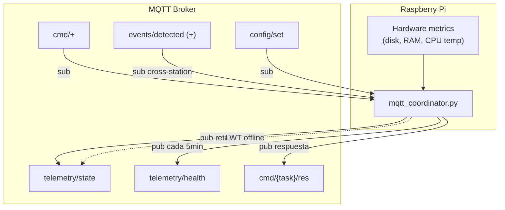
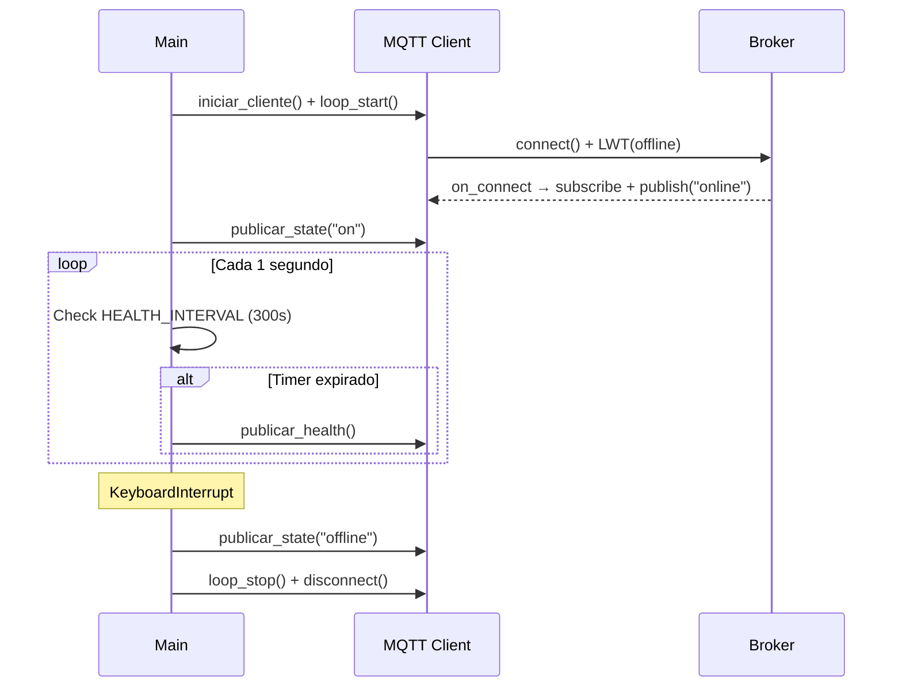

# mqtt_coordinator.py — Contexto para Agentes IA

> Agente reactivo MQTT que corre como daemon en Raspberry Pi. Publica telemetría (estado operacional + métricas de hardware), recibe comandos remotos y tiene placeholder para correlación regional de eventos sísmicos.

**Ruta**: `scripts/operation/mqtt/mqtt_coordinator.py`
**LOC**: 373 | **Lenguaje**: Python 3 | **Dependencias**: paho-mqtt, python-dotenv
**Proceso**: Daemon gestionado por Supervisor

---

## Arquitectura



---

## Tópicos MQTT

Template: `{org}/{app}/{cap}/{id}/...`
Default: `rsa/seismic/smart/{id}/...`

| Topic key | Template completo | QoS | Retain | Dirección |
|-----------|-------------------|-----|--------|-----------|
| `telemetry_state` | `…/{id}/telemetry/state` | 1 | ✅ | Pub |
| `telemetry_health` | `…/{id}/telemetry/health` | 1 | ❌ | Pub |
| `cmd_execute` | `…/{id}/cmd/+` | 1 | — | Sub |
| `cmd_response` | `…/{id}/cmd/{task_name}/res` | 1 | ❌ | Pub |
| `events_regional` | `…/+/events/detected` | 1 | — | Sub (wildcard `+`) |
| `config_set` | `…/{id}/config/set` | 1 | — | Sub |

---

## Telemetría

### State (`telemetry/state`)

Publicado en: conexión (`"online"`), inicio (`"on"`), shutdown (`"offline"`), y como LWT.

```json
{"status": "online", "timestamp": "2024-01-15T19:30:45Z"}
```

### Health (`telemetry/health`) — cada 300 segundos

```json
{
  "disk_percent": 45.2,
  "ram_percent": 32.1,
  "load_avg_15m": 0.85,
  "cpu_temp_c": 52.3,
  "throttled": "0x0",
  "uptime_s": 3600,
  "timestamp": "2024-01-15T19:30:45Z"
}
```

| Métrica | Fuente | Fallback |
|---------|--------|----------|
| `disk_percent` | `os.statvfs('/')` | `-1` |
| `ram_percent` | `/proc/meminfo` (MemTotal - MemAvailable) | `-1` |
| `load_avg_15m` | `os.getloadavg()[2]` | `-1` |
| `cpu_temp_c` | `vcgencmd measure_temp` | `-1` |
| `throttled` | `vcgencmd get_throttled` | `"unknown"` |

---

## Comandos (Dispatcher)

Recibidos vía `cmd/+`, procesados por `CommandDispatcher`:

| Comando | Handler | Estado |
|---------|---------|--------|
| `restart_acquisition` | `_cmd_restart_acquisition()` | ❌ TODO |
| `cleanup_files` | `_cmd_cleanup_files()` | ❌ TODO |
| `get_status` | `_cmd_get_status()` | ✅ Funcional |
| `extract_event` | `_cmd_extract_event()` | ✅ Funcional (Asíncrono) |

**Flujo de comando regular**:
1. Mensaje llega a `…/{id}/cmd/{task_name}`
2. `on_message()` detecta `/cmd/` en tópico, extrae `task_name`
3. `dispatcher.dispatch(task_name, payload, client)` → ejecuta handler
4. Respuesta publicada en `…/{id}/cmd/{task_name}/res` (si el handler no retorna `None`)

**Flujo de extracción asíncrono (`extract_event`)**:
1. El handler responde inmediatamente un ACK (`"status": "accepted"`).
2. Se lanza un hilo (`threading.Thread`) que invoca al orquestador `event_extractor.py`.
3. El orquestador ejecuta `extract_segment.py` (.venv) y `subir_archivo.py` (sistema) como subprocesos aislados.
4. El hilo finaliza y publica el resultado (`"completed"` o `"error"`) de forma asíncrona.

---

## Correlación Regional (Placeholder)

`EventCorrelator` escucha eventos de **otras estaciones** vía wildcard `+/events/detected`:
- Filtra eventos propios (`config["id"] not in topic`)
- Acumula en `recent_events[]`
- **TODO**: Integrar con módulo externo de correlación

---

## Clases y Funciones

| Elemento | Descripción |
|----------|-------------|
| `cargar_configuracion(config_path, env_path)` | Merge JSON config + `.env` credentials → `dict` con key `"broker"` |
| `resolver_topico(config, topic_key, **kwargs)` | Resuelve template `{org}/{app}/{cap}/{id}/...` |
| `timestamp_iso()` | UTC ISO8601 string |
| `CommandDispatcher` | Registry pattern: `handlers[task_name] → method` |
| `EventCorrelator` | Buffer de eventos regionales (placeholder) |
| `iniciar_cliente(config, logger)` | Crea `mqtt.Client`, configura LWT, callbacks, conecta |
| `publicar_state(client, config, estado, logger)` | Publica estado con retain |
| `publicar_health(client, config, logger)` | Publica métricas hardware |
| `obtener_metricas_hardware()` | Lee disk/RAM/CPU/throttled de la RPi |
| `event_extractor.py` (Módulo) | Orquesta de forma segura (con `subprocess`) la ejecución aislada de extracciones miniSEED y su carga a Drive. |
| `test_event_extractor.py` (Script) | Utilidad de diagnóstico y prueba local sin depender de la conexión MQTT.

---

## Callbacks MQTT

| Callback | Función |
|----------|---------|
| `on_connect` | Suscribe a tópicos configurados, publica `"online"` |
| `on_disconnect` | Loguea desconexión inesperada (una sola vez) |
| `on_message` | Rutea por tipo: `/cmd/` → dispatcher, `/events/detected` → correlator, `/config/set` → log |

---

## Configuración

### `configuracion_mqtt.json`

```json
{
  "id": "NOM00", "org": "rsa", "app": "seismic", "cap": "smart",
  "topics": { "telemetry_state": "{org}/{app}/{cap}/{id}/telemetry/state", "..." },
  "subscriptions": ["events_regional", "cmd_execute", "config_set"],
  "qos": { "telemetry": 1, "events": 1, "commands": 1 },
  "retain": { "telemetry_state": true, "telemetry_health": false }
}
```

### `.env` (credenciales)

```
MQTT_BROKER=<broker_address>
MQTT_PORT=1883
MQTT_USERNAME=<user>
MQTT_PASSWORD=<pass>
```

**Rutas**:
- Config: `$PROJECT_LOCAL_ROOT/configuracion/configuracion_mqtt.json`
- Env: `$PROJECT_LOCAL_ROOT/configuracion/.env`
- Log: `$PROJECT_LOCAL_ROOT/log-files/mqtt_coordinator.log`

---

## Compatibilidad paho-mqtt v1/v2

```python
try:
    client = mqtt.Client(mqtt.CallbackAPIVersion.VERSION2, userdata=userdata)  # v2.x
except AttributeError:
    client = mqtt.Client(userdata=userdata)  # v1.x
```

Callbacks usan firma compatible con ambas versiones: `(client, userdata, flags, rc, properties=None)`.

---

## Ciclo de Vida



---

## Limitaciones Conocidas

- Comandos `restart_acquisition` y `cleanup_files` no implementados (TODO)
- `EventCorrelator` solo acumula eventos sin procesarlos
- Sin reconexión automática explícita (depende del `loop_start()` de paho)
- Health metrics asumen Raspberry Pi (`vcgencmd`, `/proc/meminfo`)
- Sin TLS/SSL configurado
- `HEALTH_INTERVAL` hardcoded (300s), no configurable desde JSON
