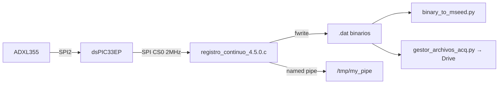
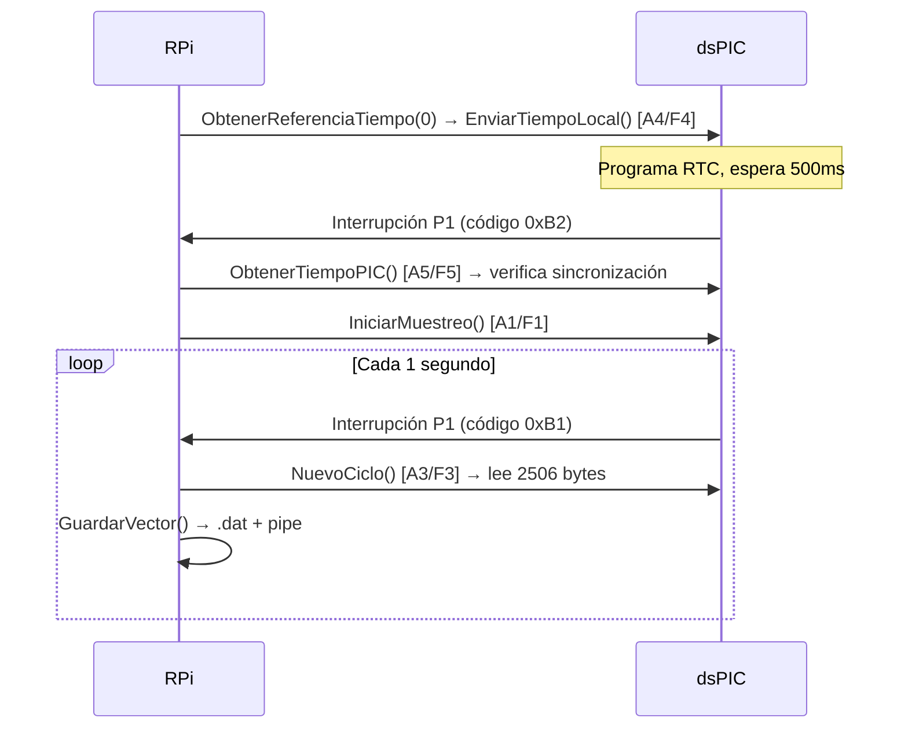

# registro_continuo_4.5.0.c — Contexto para Agentes IA

> Programa C de adquisición sísmica continua que corre en Raspberry Pi. Interfaz SPI con dsPIC33EP para capturar datos del acelerómetro ADXL355. Escribe archivos binarios `.dat` y transmite tramas por named pipe.

**Ruta**: `scripts/operation/acelerografo/registro_continuo_4.5.0.c`
**Versión**: 4.5.0 | **Lenguaje**: C | **Requiere**: root (acceso SPI/GPIO)

---

## Arquitectura



---

## Constantes Clave

| Constante | Valor | Significado |
|-----------|-------|-------------|
| `NUM_ELEMENTOS` | 2506 | Bytes por trama (1 segundo de datos) |
| `FreqSPI` | 2000000 | SPI a 2 MHz |
| `TIEMPO_SPI` | 10 | Retardo µs entre transferencias SPI |
| `PIPE_NAME` | `/tmp/my_pipe` | Named pipe para streaming |
| `P1` | 0 (wiringPi) | Pin de interrupción desde dsPIC |
| `MCLR` | 28 (wiringPi) | Pin Master Clear del dsPIC |
| `LedTest` | 26 (wiringPi) | LED indicador de estado |

---

## Flujo de main()

```
1. ConfiguracionPrincipal()
   ├─ Reinicia módulo SPI kernel (rmmod/modprobe spi_bcm2835)
   ├─ bcm2835: SPI Mode3, 2MHz, MSB first, CS0
   ├─ wiringPi: GPIO + ISR en P1 (flanco ascendente → ObtenerOperacion)
   └─ Enciende LedTest

2. ComprobarNTP()  →  ntpstat (informativo, no bloquea)

3. Lee $PROJECT_LOCAL_ROOT → construye ruta a configuracion_dispositivo.json
4. compilar_json() → obtiene id, fuente_reloj, directorios

5. ObtenerReferenciaTiempo(fuente_reloj)
   ├─ 0: EnviarTiempoLocal() → envía tiempo RPi al dsPIC vía SPI
   ├─ 1: Solicita GPS al dsPIC
   └─ 2: Solicita RTC al dsPIC

6. free(datos_configuracion)

7. Registra manejadores de señales:
   ├─ SIGPIPE → handle_sigpipe() (evita crash si pipe sin lector)
   ├─ SIGTERM → manejador_senal_terminacion() (cierre limpio)
   └─ SIGINT  → manejador_senal_terminacion()

8. crear_nuevo_archivo()  →  abre primer archivo .dat

9. mkfifo("/tmp/my_pipe")  →  crea named pipe (ignora si ya existe)

10. while(!debe_terminar) { nop; }  →  espera interrupciones

11. Cierre limpio: fclose(fp), bcm2835_spi_end(), bcm2835_close()
```

> **Nota**: El programa es dirigido por interrupciones. El bucle main solo mantiene el proceso vivo. Toda la lógica ocurre en la ISR `ObtenerOperacion()`.

---

## Funciones — Resumen Rápido

### Comunicación SPI (RPi → dsPIC)

Cada comando SPI usa delimitadores: `0xA{n}` inicio, `0xF{n}` fin.

| Función | Cmd | Propósito |
|---------|-----|-----------|
| `ObtenerOperacion()` | A0/F0 | ISR: lee tipo de operación del dsPIC |
| `IniciarMuestreo()` | A1/F1 | Arranca adquisición en el dsPIC |
| `NuevoCiclo()` | A3/F3 | Lee trama de 2506 bytes del dsPIC |
| `EnviarTiempoLocal()` | A4/F4 | Envía timestamp RPi (6 bytes) al dsPIC |
| `ObtenerTiempoPIC()` | A5/F5 | Lee timestamp + fuente de tiempo del dsPIC |
| `ObtenerReferenciaTiempo()` | A6/F6 | Indica al dsPIC qué fuente de reloj usar |

### Gestión de Archivos

| Función | Propósito |
|---------|-----------|
| `crear_nuevo_archivo()` | Crea archivo `.dat`, cierra el anterior, actualiza `NombreArchivoRegistroContinuo.tmp` |
| `debe_rotar_archivo()` | Retorna true si cambió la hora del sistema (rotación horaria) |
| `GuardarVector()` | Escribe trama en `.dat` + named pipe; invoca rotación si corresponde |

### Señales y Logging

| Función | Propósito |
|---------|-----------|
| `manejador_senal_terminacion()` | Setea `debe_terminar=1` para cierre limpio (SIGTERM/SIGINT) |
| `handle_sigpipe()` | Ignora SIGPIPE (pipe sin lector) |
| `write_log()` | Append a `registro_continuo.log` con formato `timestamp - TYPE - message` |
| `ComprobarNTP()` | Verifica sincronización NTP del sistema |

---

## Secuencia de Inicio (típica con fuente_reloj=0)



---

## Estructura de Trama (2506 bytes)

```
Byte 0:         Fuente de reloj (0:RPi, 1:GPS, 2:RTC, 3-5:Errores)
Bytes 1-2500:   250 muestras × 10 bytes/muestra
                Formato muestra: [ID(1B)] [X3,X2,X1,Y3,Y2,Y1,Z3,Z2,Z1(9B)]
Bytes 2501-2506: Timestamp [año, mes, día, hora, minuto, segundo]
```

**Códigos de fuente de tiempo del dsPIC**:
- `0`: RPi | `1`: GPS | `2`: RTC
- `3`: Error GPS (trama inválida) | `4`: Error RTC (no responde GPS) | `5`: Error GPS (timeout)

---

## Rotación Automática de Archivos

- **Frecuencia**: Cada cambio de hora del sistema (rotación horaria)
- **Mecanismo**: `GuardarVector()` llama `debe_rotar_archivo()` en cada trama; si retorna true → `crear_nuevo_archivo()`
- **Nombre archivo**: `{dir_registro_continuo}/{id}_{YYMMDD-HHMMSS}.dat`
- **Archivo temporal**: `{dir_archivos_temporales}/NombreArchivoRegistroContinuo.tmp` contiene nombre actual (línea 1) y anterior (línea 2)
- **Nota**: `crear_nuevo_archivo()` re-lee la configuración JSON en cada rotación

---

## Configuración JSON

**Ruta**: `$PROJECT_LOCAL_ROOT/configuracion/configuracion_dispositivo.json`

```json
{
  "dispositivo": {
    "id": "CHA01",
    "fuente_reloj": "1",
    "deteccion_eventos": "si"
  },
  "directorios": {
    "archivos_temporales": "/home/rsa/projects/acelerografo/datos/TMP/",
    "registro_continuo": "/home/rsa/projects/acelerografo/datos/RC/",
    "eventos_detectados": "/home/rsa/projects/acelerografo/datos/ED/"
  }
}
```

**Struct** (`lector_json.h`):
```c
struct datos_config {
    char id[10];
    char fuente_reloj[10];
    char deteccion_eventos[10];    // Presente pero no usado en v4.5.0
    char archivos_temporales[100];
    char registro_continuo[100];
    char eventos_detectados[100];  // Presente pero no usado en v4.5.0
    char eventos_extraidos[100];   // Presente pero no usado en v4.5.0
};
```

---

## Dependencias

| Librería | Paquete | Uso |
|----------|---------|-----|
| bcm2835 | `libbcm2835-dev` | SPI master |
| wiringPi | `wiringpi` | GPIO + ISR |
| jansson | `libjansson-dev` | Parser JSON |
| lector_json | Local (`libraries/`) | Wrapper de configuración |

**Compilación**:
```bash
gcc -o registro_continuo_4.5.0 registro_continuo_4.5.0.c \
    -I./libraries -L./libraries \
    -llector_json -lbcm2835 -lwiringPi -ljansson -lm -lpthread -O2 -Wall
```

---

## Logging

**Archivo**: `/home/rsa/projects/acelerografo/log-files/registro_continuo.log`
**Formato**: `YYYY-MM-DD HH:MM:SS - TYPE - message`
**Tipos**: `INFO`, `WARNING`, `ERROR`, `CRITICAL`

---

## Rendimiento Estimado

| Métrica | Valor |
|---------|-------|
| Throughput | 2506 bytes/s (1 trama/segundo) |
| Tamaño diario | ~216 MB |
| Latencia por ciclo | ~31 ms (SPI + escritura) |
| Margen CPU por ciclo | ~969 ms (96.9% idle) |
| CPU promedio (RPi 3B+) | 8-12% |
| RAM | ~6 MB RSS |

---

## Limitaciones Conocidas

- Sin validación de integridad de tramas SPI (no hay checksum)
- Archivos `.dat` sin compresión (~216 MB/día)
- Timestamp con resolución de 1 segundo
- Sin detección automática de eventos (eliminada en v4.5.0, se hace offline con ObsPy/SeisComP)
- Si RPi se reinicia, no hay protocolo de re-sincronización explícito con dsPIC
- `write_log()` abre/cierra el archivo en cada llamada (potencial cuello de botella bajo alta frecuencia de logging)
- `crear_nuevo_archivo()` re-parsea el JSON en cada rotación horaria

---

## Contexto Histórico

La v4.5.0 eliminó completamente la detección automática de eventos STA/LTA (~565 líneas), filtro FIR pasa-altos, y publicación MQTT de eventos. Archivos eliminados: `detector_eventos.c`, `detector_eventos.h`. Reducción total: de ~1518 a ~758 LOC.
